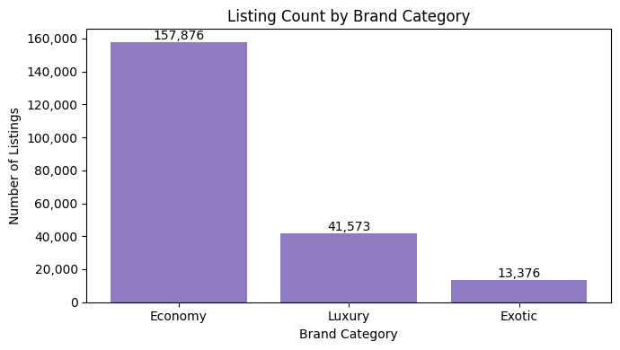
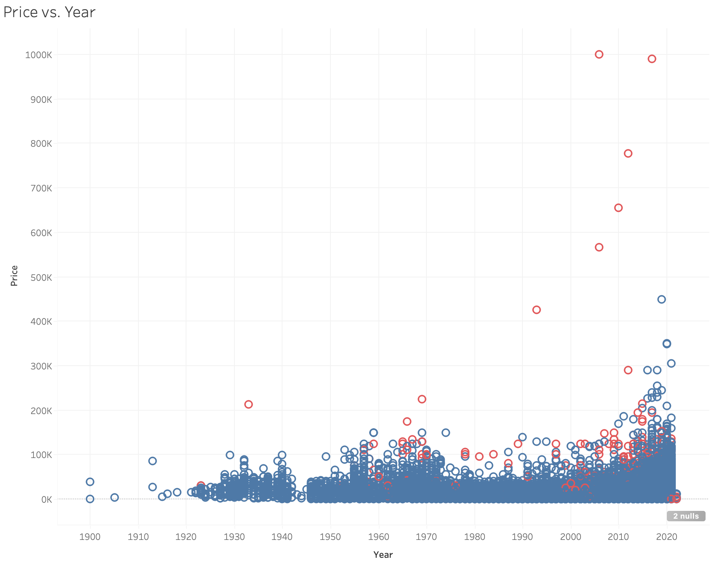
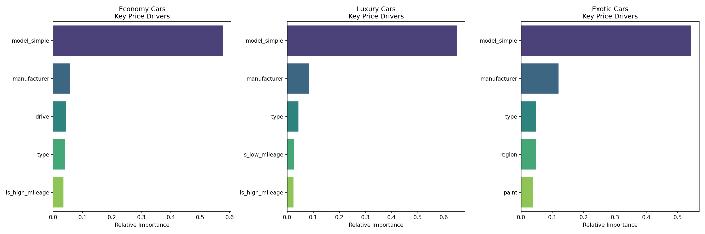
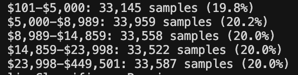
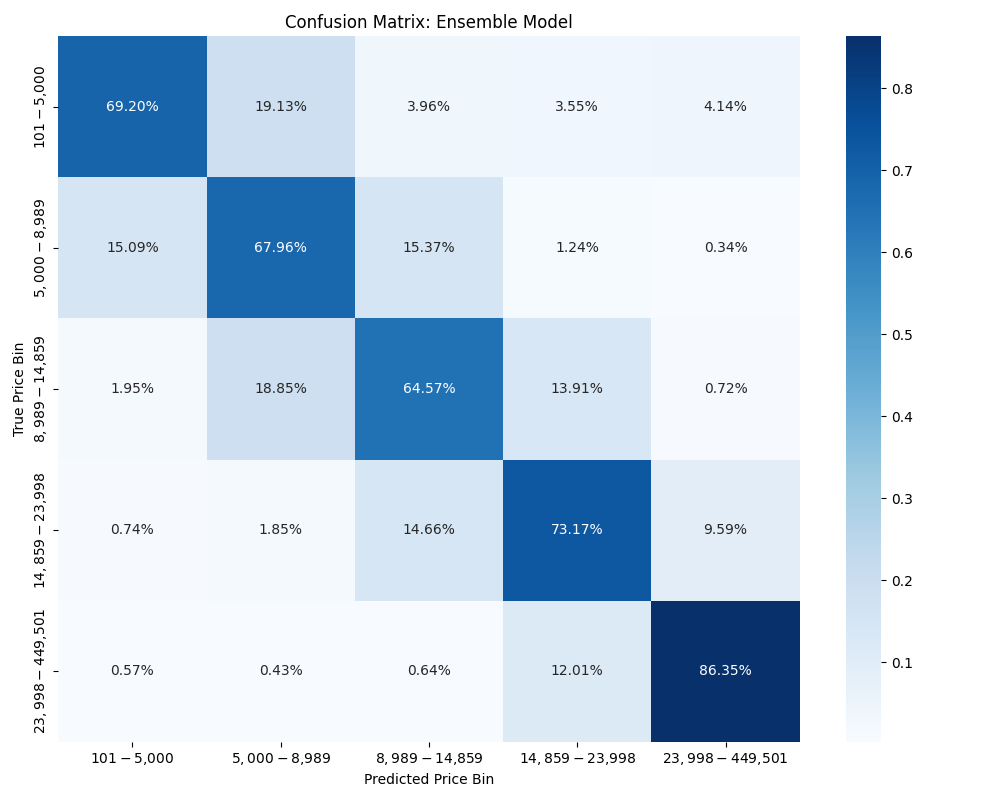
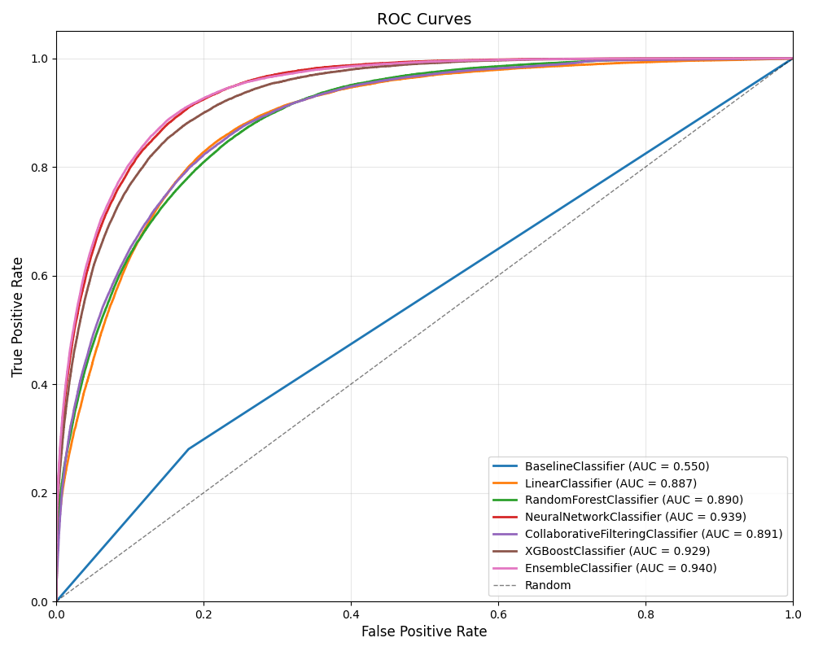

# Predicting Used Car Prices From Craigslist Data

**Author:** Colby Watts  
**Date:** December 3rd 2025

## 1. Introduction

Cars are essential to daily life and represent one of the largest purchases most people make. However, used car prices vary greatly based on factors like make, model, year, mileage, condition, and location. Buyers want to ensure they're getting the best deal, while sellers need to price their vehicles competitively.

A price-bin classifier helps identify overpriced or underpriced listings by categorizing vehicles into price ranges. In this project, this classifier was created using real-world Craigslist data.

## 2. Dataset

I used a Kaggle dataset of Craigslist vehicle listings from April–May 2021. The dataset contains:

- **426,000+ rows** with **26 columns**
- Features include year, make, model, odometer, condition, cylinders, transmission, drive type, fuel type, location, etc.
- **Many null/wrong values**: Because this is scraped data from Craigslist, nearly every column contains noisy entries, missing values, or inconsistencies.

As discussed later in feature engineering, I categorized each manufacturer into `economy`, `luxury`, and `exotic`. The distribution of these classes in the dataset is shown below: (Note this was done after data cleaning)

### 2.1 Data Cleaning

Much of the time on this project was spent cleaning the data. Anyone can list a vehicle for any price on Craigslist, leading to some very extreme price outliers, so the first thing I did was to get rid of these outliers. I set a price cap at $1,000,000, as from a manual inspection, there were no vehicles truly worth over $1,000,000 in the dataset. I also set a minumum price of $100.

As these are used vehicle listings, having anything under 20 miles is unrealistic, so a minimum odometer reading of 20 miles was set. 

The next big problem in the dataset were the vehicle model names. Again, anyone can name their vehicle whatever they want, leading to unstandardized model names. A '530i xDrive' is basically the same as a '530i', but when one-hot encoding, these names would be encoded differently. I came up with a fix that improved this by creating a new feature called `model_simple`, which stores only the first word of the model name. Now the '530i xDrive' and '530i' will be encoded the same. This didn't work perfectly as there were so many edge cases, but it greatly reduced the problem.

Next, although I set a price cap of $1,000,000, people still listed their vehicles with unrealistic prices or odometer readings. To counteract this, I came up with a scoring system that gives each vehicle a score based on how suspicious the listing looks. If the score exceeded 4.5, it was removed from the dataset. I came up with a series of conditional statements to score cars. For example, if an economy car was priced over $90,000 that added a score of 2. To detect extreme outliers, I computed a robust Z-score for each listing using the median and MAD: `robust_z = |price − median_price| / MAD`. Listings more than 5x the typical variation added 2 points to the suspicious-listing score, 8x added 3 points, and 20x added 5 points.

After my data cleaning, I was left with **209,000 row** of useable data. The graph below shows the price of vehicles vs their model year. The datapoints in red indicate that my scoring system deemed them suspicious and removed them. Many of the red datapoints are clear outliers.

## 3. Feature Engineering & Importance

I engineered features to try and capture meaningful signals about a vehicle's value:

- **Brand category mapping**: I created a mapping of vehicle brands to one of `economy`, `luxury`, or `exotic`. I did this because an economy car will be priced differently than an exotic car for example.
- **Miles per year**: This feature is calculated by dividing `odometer / age`. The average number of miles per year for a car is roughly 12,000, so if a car is far below or above this, it is an indication that its price will be higher or lower. 
- **Region**: I created a mapping of vehicle brands to the continent they originate from. For example, a newer European car usually costs more than a newer Japanese car, so giving the models the ability to group manufacturers together can give us some kind of singal. This actually ended up being an important feature for exotic cars as outlined in the next section.
- **Binary flags:** I created several binary flags: `is_new`, `is_classic`, `is_low_mileage`, `is_high_mileage`, `is_4wd`, `is_automatic`, etc. Some of these are new features, like `is_new`, which is true if the vehicle is newer than 2 years old, and others are basically the same as one-hot encoded features. For example, `is_4wd` would be created by one-hot encoding the drivetrain feature. I did this because a lot of the categorical features introduced several columns when one-hot encoding, and I only cared about the presence of certain high-signal attributes rather than every possible category.

### 3.1 Feature Importance by Category

I used my XGBoost model to analyze feature importance within each brand category, revealing not-so-surprising data:

Model name and manufacturer were the most important features across brand categories. Besides these features, each brand category has subtle differences in feature importance
- **Economy Cars:** `drive`, `type`, and `is_high_mileage` were important. This makes sense because buyers in this category are sensitive to drivetrain type (FWD, RWD, 4WD), body style, and mileage as they all significantly affect reliability and operating costs.
- **Luxury Cars:** `type`, `is_low_mileage`, and `is_high_mileage` were important. This also makes logical sense as luxury buyers care a lot about condition and mileage since wear and tear on luxury vehicles affects the resale value.
- **Exotic Cars:** `type`, `region`, and `paint` were important features. This checks out as brands, like Porsche, that make SUVs and exotic coupes, price their SUVs and coupes very differently. Also paint options on exotics cars can increase value significantly. Region was also important as many of the brands in the exotic category are European.

## 4. Modeling Approach

### 4.1 Classification Setup

We created **5 price bins** representing approximately 20% of the dataset each, using percentile-based binning on the training data only to avoid data leakage. The goal was to predict which price bin a vehicle falls into, turning a regression problem into a classification task. The price bins are shown below:

### 4.2 Models Tested

I tried several different models:

1. **Baseline Model:** Predicts the median price bin for the vehicle's manufacturer (27.6% precision).

2. **Neural Network (MLP):** Multi-layer perceptron with 200×100 hidden layers. This was the best standalone model (71.7% precision). Neural networks excel at finding non-linear relationships, such as "paint affects the price of an exotic car much more than an economy car".

3. **XGBoost:** XGBoost builds many decision trees sequentially. Each tree corrects the errors of the previous one. This allows it to segment the data into “pockets”, capturing patterns such as price jumps between 2WD and 4WD variants of the same vehicle.

4. **Collaborative Filtering:** This model achieved 64.0% precision by finding similar vehicles and using their price bins to make predictions. Because there are no users in this dataset, this is an item-item collaborative filtering setup, where vehicles are compared to vehicles instead of users to items. The approach works by creating a vehicle x feature interaction matrix where each row represents a vehicle and each column represents a feature (`manufacturer_<name>`, `is_luxury`, `year`, etc.). I then used PCA to reduce the dimensionality from thousands of features down to about 70 components while preserving 95% of the variance. When predicting a price bin for a new vehicle, the model finds the 50 most similar vehicles using cosine similarity and then uses a weighted vote from those neighbors' price bins.

5. **Ensemble Model:** Classifier combining Neural Network (40%), XGBoost (40%), and Collaborative Filtering (20%). This ensemble fixes blind spots in each individual model.

### 4.3 Ensemble Reasoning

Each model has different strengths:
- **Neural Network:** Learns complex non-linear interactions between features.
- **XGBoost:** Excellent at finding rule-based patterns, finding "pockets" in the data and handling categorical features.
- **Collaborative Filtering:** Acts as a reality check by finding similar vehicles, even for rare edge cases.

By combining them, the ensemble uses the strengths of each while compensating for individual weaknesses.

## 5. Results

### 5.1 Evaluation Metrics

I evaluated each model using precision, recall, F1-score, and MAP. I am mainly concerned with **precision** as when we predict a price bin, we care if it is the correct bin.

### 5.2 Performance

The **Ensemble model is able to predict the correct bin 72.6% of the time**, which is good considering the baseline is only 27.6% and this is a 5-class problem. This represents a **2.6x improvement** over random guessing and shows the model's ability to extract meaningful signals from the data.

### 5.3 Model Analysis

The confusion matrix shows that when the model makes errors, they are typically off by one bin, rather than major misclassifications. This indicates the model has learned meaningful price relationships. However, If a car is listed for $24,000, and the bin edge is at $23,998 (which it is), it's very easy to misclassify the vehicle. This is just a flaw in using price bins and something using a regression model would solve.

The ROC-AUC curve of **0.94** for the ensemble model demonstrates great discriminative ability from teh model showing that it rarely confuses low-priced and high-priced vehicles. Although ROC-AUC is imperfect for multi-class classification, as it treats all misclassifications the same, a score of 0.94 is still impressive.

## 6. Conclusion

This project demonstrates that vehicle prices can be predicted with strong precision using a combination of features from the original dataset and from feature engineering. The ensemble model of the neural network, XGBoost and collaborative filtering models achieves 72.6% precision, greatly outperforming my baseline by 2.6x.

Much work was put into cleaning the noisy Craigslist dataset, and although most of the erroneous data was cleaned or removed, there could still be more done in the future. 
Also in the future, reframing this problem as a regression problem could produce more accurate price estimates than discrete bins.
