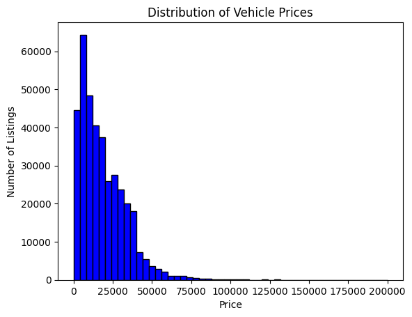
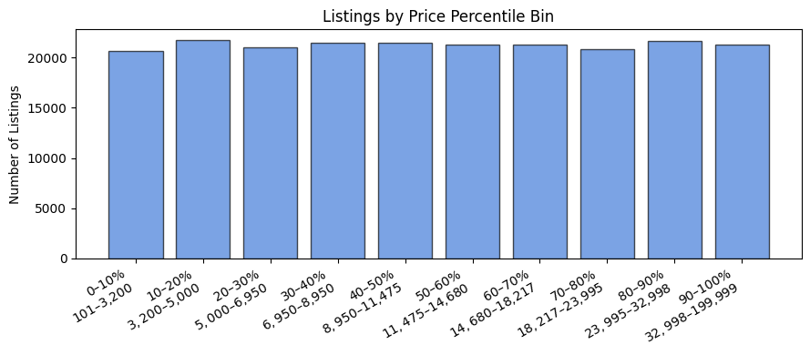

# Vehicles Craigslist Listings — EDA Summary

## Dataset Selection
- **Source**: `vehicles.csv` from Kaggle. It contains Craigslist vehicle listings:
https://www.kaggle.com/datasets/austinreese/craigslist-carstrucks-data?resource=download

- **Structure**: The dataset contains 426,880 rows with 26 columns. Some of the columns are make, manufacturer, odometer, price, condition, drive, transmission, location, etc. There are a lot of missing rows and bad data within this dataset as anyone can create a Craigslist listing. 
- **Relevance**: This dataset allows me to do a lot of data cleaning. After I'm done cleaning the data, I want to make a regression model to predict the price of a vehicle. Then to fit the contraints of the project, I will create price bins to classify the vehicle in a certain price range.

## EDA

- **Size and Locations**: 426,880 listings over two months (April–May 2021) across 51 US states. County is entirely missing from the dataset
- **Feature percent missing**: `county` (100%), `size` (~72%), `cylinders` and `condition` (~41%), `VIN` (~38%), `drive`/`paint_color` (~30%). Core fields (`price`, `year`, `odometer`, `state`) are largely complete.
- **Price distribution**: Very right skewed with extreme outliers (one listing is for $3.7 billion). 



There are roughly equal numbers of listings for each price percentile bin, which I thought was interesting.


- **Categorical signals**:
  - **Manufacturer volume & medians**: Ford (36.3K listings, median \$12.9K), Chevrolet (28.4K, \$11.9K), Toyota (19.1K, \$9.9K), Honda (13.4K, \7.9K), Nissan (10.9K, \8.9K).
  - **Vehicle types**: Sedans (45.5K, median \8.9K), SUVs (42.7K, \$12.9K), Trucks (16.9K, \$19.9K). Also There is a "Pickup" type which I'm assuming is the same as truck.
  - **State-level medians**: Each state has a different median listing price. Alaska is leading with a median listiing price of 21.9K. Delaware has the lowest listing price at 7.3K. 

## Data Cleaning
- **Missing make/model**: If the make of a vehicle is missing, then the row is dropped. If the model is missing, it is kept, but I might change this in the future.
- **Numeric Bounds**: Filtered out obviously incorrect prices (`price < $100 or > $1,000,000`) and fake odometer readings (<=20 miles).
- **New features**: Calculated vehicle `age = max(2022 − year, 1)` and `price_mileage_ratio` which is used to determine if the price of a vehicle is incorrect for the listed number of miles.
- **Brand category mapping**: Grouped manufacturers into `economy`, `luxury`, or `exotic` tiers. We can see the distribution below:


These categories are used alongside `age` and `price_mileage_ratio` to determine if a listing contains false information. For example a new Ferrari is going to have a much different price/mileage ratio than a 2001 Honda Civic, so we need to treat them differently. 
- **Deduplication**: Searched for listings with the same manufacturer, model, price, year, and odometer. This likely means that the listing is a duplicate which we want to remove.
- **Model Name Sanitization**: The model names are not standardized. For example, there is a BMW 530i xDrive, and a BMW 530i sedan. These are basically the same car but have different model names, so they aren't automatically grouped together. What I did to fix this was select only the first word from the model. So now both vehicles are listed as a 530i. This doesn't work perfectly, but it is a lot better than without it.
- **Data Cleaning Process**: I used all these features combined to create a series of if statements to assign each vehicle a score. For example, if the robust z score of the price is higher than 20, it is almost guaranteed that the listing price is false, so I add a score of 5. Or if the branc category is `economy` and the price is over $90,000, it's kind of suspisious, so I add a score of 2. I've implemented a bunch of these scoring methods, and at the end, if the score is over 4.5, then I remove it from the dataset as it's likely not an honest listing and will throw off my training. I came up with the 4.5 threshold by manually looking through the scores sorted from highest to lowest and looking at what score the listings seemed to be real.


## Anticipated Challenges
I've started to do some data cleaning, but it's proving very difficult. As anyone can create a Craigslist listing, there are tons of listings with obviously fake mileage (for example a 2007 BMW 328i with 500 miles for 7K.) or fake prices (a 2008 Ford Explorer for $123,456). It's hard to filter this noise against listings that truly have low miles. For example, there is a 2009 Ford Shelby Mustang GT500 for $135,000 with 3,400 miles. I have Ford in the economy class, so if the price is over $90k, then it flags it as suspisous. This is a real listing so we don't want to get rid of it. There are a lot of edge cases like this. 

I was looking at the highest priced car for each brand to try and get rid of obvious price outliers. Before my data cleaning, I had obvious outliers like:
```
chrysler:
  Price: $655,000
  Model: town & country
buick:
  Price: $123,456
  Model: lacrosse
```

But after my data cleaning I was able to filter out these results and the most expensive Buick and Chrysler are:
```
buick:
  Price: $110,000
  Model: skylark convertible
chrysler:
  Price: $86,000
  Model: valiant charger
```

The Buick is a 1953 and the $110,000 listing price is correct. The Chrysler is a 1973 and the listing price is also correct, based off looking at comps online.

However, my data cleaning is not perfect, as I removed a Mazda RX7 which was listed at $45,000. There were also a few other real listings that my scoring system got rid of, so I still need to tweak it.

Below is a graph of price vs. year. The datapoints colored in red are classified as fake listings by my scoring system. You can see the obvious price outliers are detected:

