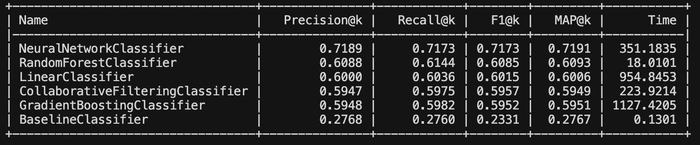
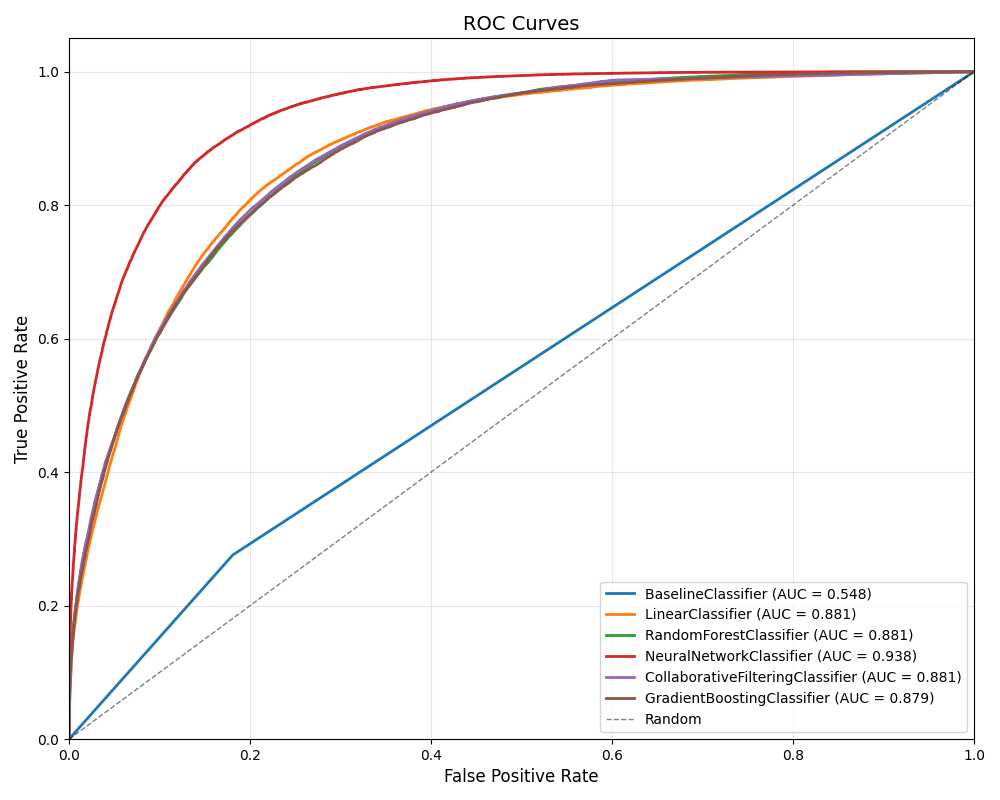

# Vehicles Craigslist Listings — First Draft Summary

## Introduction

The goal of this project is to predict price ranges from Craigslist listings. The dataset contains 426,880 listings with various features including manufacturer, year, odometer, condition, and location. After data cleaning, I developed multiple classification models to predict which price bin a vehicle falls into, with the goal of identifying the most effective approach for this problem.

## Price Binning

As mentioned previously, in order to turn this regression problem into a classification problem, I created price bins which each contain roughly 20% of the data:
```
$101-$5,000: 33,808 samples (19.9%)
$5,000-$8,955: 34,295 samples (20.1%)
$8,955-$14,750: 34,019 samples (20.0%)
$14,750-$23,998: 34,061 samples (20.0%)
$23,998-$449,501: 34,077 samples (20.0%)
```

These bins are created on the train data only to avoid data leakage.

## Feature Creation

Some new features I created this week were `region` and `miles_per_year`.

- **Region**: Region is a mapping of car brand to the region it is from: North America, Europe, or Asia. I did this because different regions produce vehicles in different price brackets. For example, European cars tend to be more expensive than cars from Asia. This didn't really make a huge improvement on my evaluations. Thinking about it more now, this might not be the right line of thinking as these are Craigslist listings, not brand new cars, and 80% of listings are below $24K. European cars depreciate much more than Asian cars. I'll have to revisit this idea.

- **Miles per year**: This feature is calculated by dividing `odometer / age`. The average number of miles per year for a car is roughly 12,000, so if a car is far below or above this, it is an indication that its price will be higher or lower. 

## Model Creation

I created 6 new models to evaluate. I have done some feature exploration, but more is needed.

- **Baseline Model**: I created a baseline model to compare all of my other results to. The baseline model predicts the median price bin for that manufacturer. So, if the car we're predicting the price for is a BMW, it will look at the median price bin for all BMWs and predict that bin. It's not super accurate, obtaining a precision of only .2768, but it's a good baseline.

- **Linear Classifier**: This model uses linear regression to predict a price for each vehicle and then prices are binned. It performed relatively well achieving a precision of .6000. Right now, I am feeding it every feature I've created, which is not great, so in the future, I'm going to do more in-depth feature selection as it shows potential.

- **Random Forest Classifier**: This model uses a random forest to predict price bins for vehicles. It is one of my best performing models, besides the MLP. I have done more feature selection on this model; however, it does better with the more features I give it. I suppose this makes sense as random forests aren't like distance-based nearest neighbor models that suffer from the curse of dimensionality. Random forests select which features are most important and ignore the ones that aren't. Giving the random forest more features allows them to pick up on more subtle differentiations between datapoints. I don't see this model improving much more as I've put a good amount of time into trying to refine it.

- **Neural Network Classifier**: This model uses a multi-layer perceptron with 2 hidden layers: 100 and 50. This is my best performing model, achieving .7189 precision. MLPs are able to pick up on complex non-linear relationships, and I haven't tried any deep-learning techniques so far so I thought it would be interesting. I'm going to try adding more layers and changing the features I'm using for it.

- **Collaborative Filtering Classifier**: This model uses collaborative filtering and PCA to create 50 latent factors to predict price bins. It didn't perform as well as I would have liked, and I think it might be due to the fact that the models in my dataset aren't standardized very well, leading to a sparse matrix. Collaborative filtering is struggling with cold start as the same model is encoded as several different models due to the fact that people on Craigslist can name their listing anything they want.

- **Gradient Boosting Classifier**: I also thought this model would perform better, as we were told that gradient boosting models are like "magic random forests". It was my worst performing model besides the baseline. I think I need to do more hyperparameter tuning or train it longer. I also might try XGBoost.

## Evaluation

To evaluate my models, I used Precision@k, Recall@k, F1@k, and MAP@k. I'm mainly concerned with precision as I want the model to predict the correct price bin for the vehicle.

The evaluation results can be seen below:



I also created ROC curves for each model:



## Future Improvements

Before finalizing the project, I'd like to try creating some more features to reduce the dimensionality of my matrices. That would improve the performance of my neural network, linear classifier, collaborative filtering classifier, and gradient boosting classifier. I also plan on doing more hyperparameter tuning on the neural network, collaborative filtering model, and gradient boosting model. I might try an ensemble model with some of my best performing models to see how it performs.


